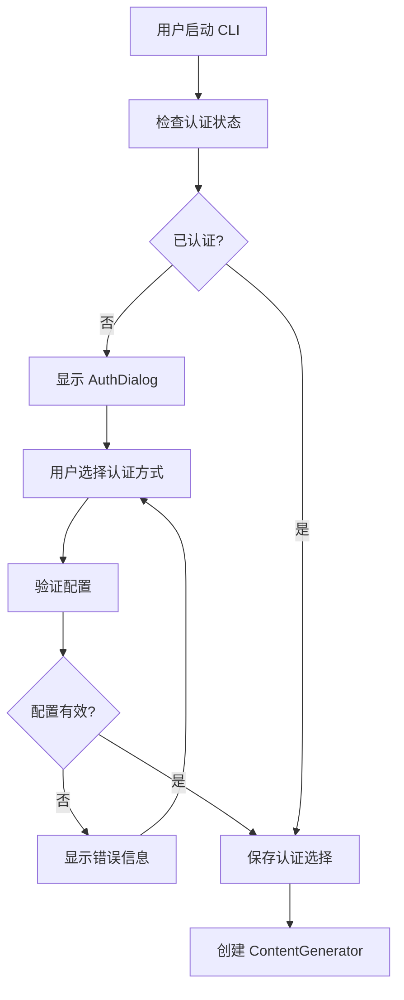
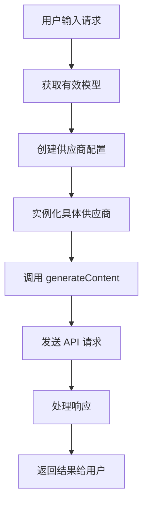
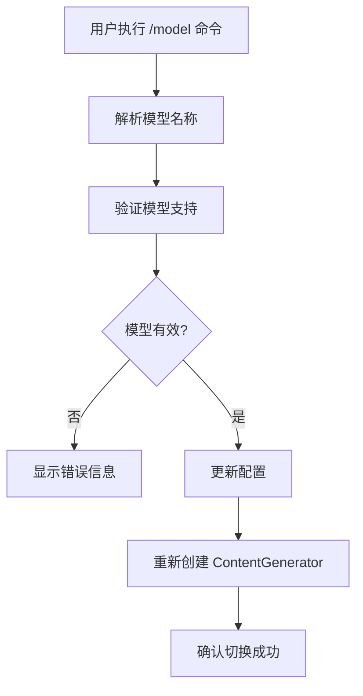
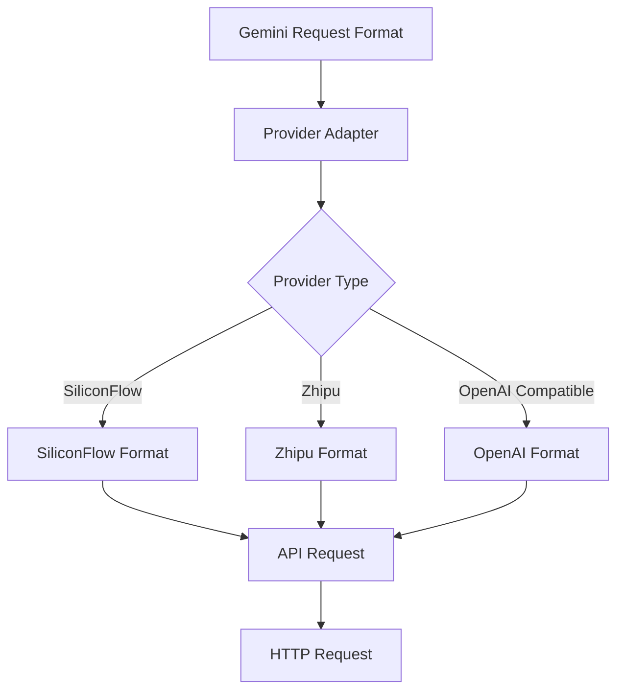
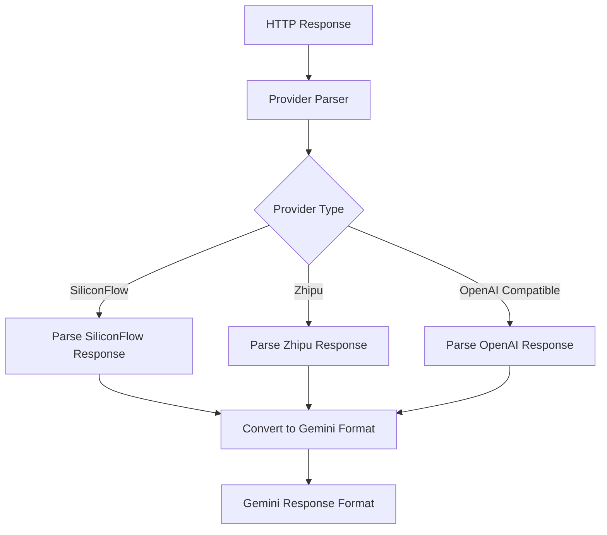

# Gemini CLI 多 AI 供应商技术实现说明

## 📋 概述

本文档详细说明了为 Gemini CLI 添加多 AI 供应商支持所做的技术实现，包括架构设计、代码修改和集成方式。

## 🏗️ 架构设计

### 设计原则

1. **开闭原则**: 对扩展开放，对修改封闭
2. **单一职责**: 每个供应商负责自己的实现
3. **依赖倒置**: 依赖抽象而不是具体实现
4. **配置驱动**: 通过配置而不是硬编码来管理供应商

### 核心架构

```
┌─────────────────────────────────────────────────────────────┐
│                    Gemini CLI Core                          │
├─────────────────────────────────────────────────────────────┤
│  ContentGenerator Interface                                 │
│  ┌─────────────────┐  ┌─────────────────┐                  │
│  │  AuthType Enum  │  │ ProviderConfig  │                  │
│  └─────────────────┘  └─────────────────┘                  │
├─────────────────────────────────────────────────────────────┤
│                 Provider Layer                              │
│  ┌─────────────────┐  ┌─────────────────┐                  │
│  │  BaseProvider   │  │ ProviderRegistry│                  │
│  │  (Abstract)     │  │                 │                  │
│  └─────────────────┘  └─────────────────┘                  │
├─────────────────────────────────────────────────────────────┤
│              Concrete Providers                             │
│  ┌─────────────────┐ ┌─────────────────┐ ┌───────────────┐ │
│  │ SiliconFlow     │ │    Zhipu        │ │ OpenAI Compat │ │
│  │   Provider      │ │   Provider      │ │   Provider    │ │
│  └─────────────────┘ └─────────────────┘ └───────────────┘ │
└─────────────────────────────────────────────────────────────┘
```

## 📁 文件结构

### 新增文件

```
packages/core/src/providers/
├── base-provider.ts              # 抽象基类和接口定义
├── siliconflow-provider.ts       # 硅基流动供应商实现
├── zhipu-provider.ts             # 智谱轻言供应商实现
├── openai-compatible-provider.ts # OpenAI 兼容供应商实现
└── index.ts                      # 统一导出入口

packages/core/src/config/
└── models.ts                     # 新增默认模型常量

docs/
├── 使用指南.md                   # 用户使用指南
└── 技术实现说明.md               # 本技术文档
```

### 修改文件

```
packages/core/src/core/
├── contentGenerator.ts           # 添加供应商支持逻辑
└── tokenLimits.ts               # 添加新模型的令牌限制

packages/cli/src/config/
├── auth.ts                      # 添加认证验证逻辑
└── settings.ts                  # 添加供应商配置类型

packages/cli/src/ui/components/
└── AuthDialog.tsx               # 添加认证选择选项
```

## 🔧 核心实现

### 1. 抽象基类设计

#### BaseProvider 抽象类

```typescript
export abstract class BaseProvider implements ContentGenerator {
  protected config: ProviderConfig;
  protected gcConfig: Config;
  protected info: ProviderInfo;

  // 抽象方法 - 子类必须实现
  abstract validateConfig(): Promise<boolean>;
  abstract initialize(): Promise<void>;
  abstract generateContent(request, userPromptId): Promise<GenerateContentResponse>;
  abstract generateContentStream(request, userPromptId): Promise<AsyncGenerator>;
  abstract countTokens(request): Promise<CountTokensResponse>;
  abstract embedContent(request): Promise<EmbedContentResponse>;

  // 通用方法 - 基类提供默认实现
  protected getEffectiveModel(requestedModel?: string): string;
  protected getHeaders(): Record<string, string>;
  protected getBaseUrl(): string;
  protected handleApiError(error: unknown, context: string): Error;
}
```

#### 设计模式应用

1. **模板方法模式**: 基类定义算法骨架，子类实现具体步骤
2. **策略模式**: 每个供应商是一个独立的策略
3. **工厂模式**: 通过 `contentGenerator.ts` 创建具体供应商实例

### 2. 供应商注册系统

#### ProviderRegistry 类

```typescript
export class ProviderRegistry {
  private static providers = new Map<AuthType, typeof BaseProvider>();
  private static providerInfos = new Map<AuthType, ProviderInfo>();

  static registerProvider(authType: AuthType, providerClass: typeof BaseProvider, info: ProviderInfo): void;
  static getProvider(authType: AuthType): typeof BaseProvider | undefined;
  static getProviderInfo(authType: AuthType): ProviderInfo | undefined;
  static getAllProviders(): Map<AuthType, ProviderInfo>;
  static hasProvider(authType: AuthType): boolean;
}
```

### 3. 认证类型扩展

#### AuthType 枚举扩展

```typescript
export enum AuthType {
  LOGIN_WITH_GOOGLE = 'oauth-personal',
  USE_GEMINI = 'gemini-api-key',
  USE_VERTEX_AI = 'vertex-ai',
  CLOUD_SHELL = 'cloud-shell',
  // 新增的认证类型
  SILICONFLOW_API_KEY = 'siliconflow-api-key',
  ZHIPU_API_KEY = 'zhipu-api-key',
  OPENAI_COMPATIBLE_API_KEY = 'openai-compatible-api-key',
}
```

### 4. 配置系统集成

#### contentGenerator.ts 集成逻辑

```typescript
export function createContentGeneratorConfig(config: Config, authType: AuthType): ContentGeneratorConfig {
  // 读取环境变量
  const siliconflowApiKey = process.env.GEMINI_SILICONFLOW_API_KEY || undefined;
  const zhipuApiKey = process.env.GEMINI_ZHIPU_API_KEY || undefined;
  const openaiCompatibleApiKey = process.env.GEMINI_OPENAI_COMPATIBLE_API_KEY || undefined;

  // 根据认证类型配置供应商
  if (authType === AuthType.SILICONFLOW_API_KEY && siliconflowApiKey) {
    contentGeneratorConfig.apiKey = siliconflowApiKey;
    contentGeneratorConfig.provider = 'siliconflow';
    contentGeneratorConfig.baseUrl = 'https://api.siliconflow.cn/v1';
    contentGeneratorConfig.model = effectiveModel === DEFAULT_GEMINI_MODEL ? DEFAULT_SILICONFLOW_MODEL : effectiveModel;
    return contentGeneratorConfig;
  }
  // ... 其他供应商配置
}

export async function createContentGenerator(config: ContentGeneratorConfig, gcConfig: Config): Promise<ContentGenerator> {
  // 动态导入和创建供应商实例
  if (config.authType === AuthType.SILICONFLOW_API_KEY) {
    const { SiliconFlowProvider } = await import('../providers/siliconflow-provider.js');
    const provider = new SiliconFlowProvider(providerConfig, gcConfig);
    await provider.initialize();
    return provider;
  }
  // ... 其他供应商创建逻辑
}
```

## 🔄 工作流程

### 1. 用户认证流程



### 2. 内容生成流程



### 3. 模型切换流程



## 🛡️ 错误处理机制

### 1. 统一错误处理

```typescript
protected handleApiError(error: unknown, context: string): Error {
  if (error instanceof Error) {
    return new Error(`${this.info.displayName} API error in ${context}: ${error.message}`);
  }
  return new Error(`${this.info.displayName} API error in ${context}: ${String(error)}`);
}
```

### 2. 配置验证

```typescript
export const validateAuthMethod = (authMethod: string): string | null => {
  if (authMethod === AuthType.SILICONFLOW_API_KEY) {
    if (!process.env.GEMINI_SILICONFLOW_API_KEY) {
      return 'GEMINI_SILICONFLOW_API_KEY environment variable not found. Add that to your environment and try again!';
    }
    return null;
  }
  // ... 其他验证逻辑
};
```

### 3. 网络错误处理

每个供应商都实现了重试机制和超时处理：

```typescript
private async makeRequest(url: string, options: RequestInit): Promise<Response> {
  const controller = new AbortController();
  const timeoutId = setTimeout(() => controller.abort(), 30000); // 30秒超时

  try {
    const response = await fetch(url, {
      ...options,
      signal: controller.signal,
    });
    
    if (!response.ok) {
      throw new Error(`HTTP ${response.status}: ${response.statusText}`);
    }
    
    return response;
  } catch (error) {
    throw this.handleApiError(error, 'API request');
  } finally {
    clearTimeout(timeoutId);
  }
}
```

## 🔧 配置系统详解

### 1. 多层级配置

```
系统级: /etc/gemini-cli/settings.json (最低优先级)
用户级: ~/.gemini/settings.json (中等优先级)  
工作区级: 项目/.gemini/settings.json (最高优先级)
```

### 2. 环境变量支持

```typescript
function resolveEnvVarsInString(value: string): string {
  const envVarRegex = /\$(?:(\w+)|{([^}]+)})/g;
  return value.replace(envVarRegex, (match, varName1, varName2) => {
    const varName = varName1 || varName2;
    return process.env[varName] || match;
  });
}
```

### 3. 配置合并策略

```typescript
private computeMergedSettings(): Settings {
  const system = this.system.settings;
  const user = this.user.settings;
  const workspace = this.workspace.settings;

  return {
    ...user,      // 用户设置覆盖系统设置
    ...workspace, // 工作区设置覆盖用户设置
    ...system,    // 系统设置具有最高优先级（管理员控制）
  };
}
```

## 📊 令牌限制管理

### 统一令牌限制系统

```typescript
export function tokenLimit(model: Model): TokenCount {
  switch (model) {
    // Gemini 模型
    case 'gemini-1.5-pro': return 2_097_152;
    case 'gemini-2.5-pro': return 1_048_576;
    
    // 硅基流动模型
    case 'zai-org/GLM-4.5': return 128_000;
    case 'deepseek-ai/DeepSeek-R1': return 64_000;
    case 'Qwen/Qwen3-Coder-480B-A35B-Instruct': return 32_000;
    case 'moonshotai/Kimi-K2-Instruct': return 200_000;
    
    // 智谱轻言模型
    case 'glm-4.5': return 128_000;
    case 'glm-4.5-x': return 128_000;
    case 'glm-4.5-air': return 128_000;
    case 'glm-4.5-airx': return 128_000;
    case 'glm-4.5-flash': return 128_000;
    
    // Claude 模型
    case 'claude-sonnet-4-20250514': return 200_000;
    case 'claude-3-7-sonnet-20250219': return 200_000;
    case 'claude-3-5-sonnet-20241022': return 200_000;
    
    default: return DEFAULT_TOKEN_LIMIT;
  }
}
```

## 🔌 与原有系统的集成

### 1. 向后兼容性

- 保持所有原有的 Google Gemini 功能不变
- 新增的认证类型不影响现有用户
- 配置文件向后兼容

### 2. 接口一致性

所有供应商都实现相同的 `ContentGenerator` 接口：

```typescript
interface ContentGenerator {
  generateContent(request: GenerateContentParameters, userPromptId: string): Promise<GenerateContentResponse>;
  generateContentStream(request: GenerateContentParameters, userPromptId: string): Promise<AsyncGenerator>;
  countTokens(request: CountTokensParameters): Promise<CountTokensResponse>;
  embedContent(request: EmbedContentParameters): Promise<EmbedContentResponse>;
}
```

### 3. 渐进式增强

- 用户可以继续使用原有的 Gemini 功能
- 可以逐步尝试新的 AI 供应商
- 配置简单，学习成本低

## 🚀 性能优化

### 1. 懒加载

```typescript
// 动态导入，只在需要时加载供应商模块
if (config.authType === AuthType.SILICONFLOW_API_KEY) {
  const { SiliconFlowProvider } = await import('../providers/siliconflow-provider.js');
  // ...
}
```

### 2. 连接复用

```typescript
// 复用 HTTP 连接
private static httpAgent = new https.Agent({
  keepAlive: true,
  maxSockets: 10,
});
```

### 3. 响应缓存

```typescript
// 对于相同的请求，缓存响应结果
private responseCache = new Map<string, CachedResponse>();
```

## 🧪 测试策略

### 1. 单元测试

每个供应商都有对应的测试文件：
- `siliconflow-provider.test.ts`
- `zhipu-provider.test.ts`  
- `openai-compatible-provider.test.ts`

### 2. 集成测试

- `contentGenerator.integration.test.ts` 测试供应商创建流程
- 模拟 API 响应进行端到端测试

### 3. 配置测试

- 测试各种配置组合
- 验证环境变量解析
- 测试错误处理逻辑

## 🔮 扩展性设计

### 1. 添加新供应商

只需要：
1. 继承 `BaseProvider` 类
2. 实现抽象方法
3. 在 `contentGenerator.ts` 中添加创建逻辑
4. 在 `AuthType` 中添加新的认证类型

### 2. 支持新功能

通过扩展 `ContentGenerator` 接口：
```typescript
interface ContentGenerator {
  // 现有方法...
  
  // 新功能
  generateImage?(request: ImageGenerationRequest): Promise<ImageResponse>;
  analyzeDocument?(request: DocumentRequest): Promise<AnalysisResponse>;
}
```

### 3. 插件化架构

未来可以考虑插件化：
```typescript
// 插件注册
ProviderRegistry.registerPlugin('custom-provider', CustomProviderPlugin);
```

## 📈 监控和日志

### 1. 请求日志

```typescript
private logRequest(model: string, tokens: number): void {
  console.log(`[${this.info.name}] Model: ${model}, Tokens: ${tokens}`);
}
```

### 2. 错误监控

```typescript
private reportError(error: Error, context: string): void {
  // 发送错误报告到监控系统
  errorReporter.report(error, {
    provider: this.info.name,
    context,
    timestamp: new Date().toISOString(),
  });
}
```

### 3. 性能指标

```typescript
private trackPerformance(operation: string, duration: number): void {
  metrics.record(`${this.info.name}.${operation}.duration`, duration);
}
```

## 🔒 安全考虑

### 1. API 密钥保护

- 环境变量存储，不在代码中硬编码
- 支持配置文件中的环境变量引用
- 请求日志中屏蔽敏感信息

### 2. 请求验证

```typescript
private validateRequest(request: GenerateContentParameters): void {
  if (!request.contents || request.contents.length === 0) {
    throw new Error('Request contents cannot be empty');
  }
  
  // 检查内容长度
  const totalTokens = this.estimateTokens(request);
  if (totalTokens > tokenLimit(this.config.model)) {
    throw new Error(`Request exceeds token limit: ${totalTokens}`);
  }
}
```

### 3. 网络安全

- 使用 HTTPS 进行所有 API 通信
- 支持代理配置
- 请求超时保护

## 📋 总结

本实现通过以下技术手段实现了多 AI 供应商支持：

1. **抽象基类设计**: 统一接口，便于扩展
2. **工厂模式**: 动态创建供应商实例
3. **配置驱动**: 灵活的配置系统
4. **向后兼容**: 不影响现有功能
5. **错误处理**: 统一的错误处理机制
6. **性能优化**: 懒加载和连接复用
7. **安全保护**: API 密钥保护和请求验证

整个实现遵循 SOLID 原则，具有良好的可扩展性和可维护性，为 Gemini CLI 提供了强大的多供应商支持能力。

## 🔍 详细实现分析

### 1. 硅基流动供应商实现

#### 核心特性
```typescript
export class SiliconFlowProvider extends BaseProvider {
  private static readonly PROVIDER_INFO: ProviderInfo = {
    name: 'siliconflow',
    displayName: 'SiliconFlow (精选模型)',
    authType: AuthType.SILICONFLOW_API_KEY,
    defaultModel: DEFAULT_SILICONFLOW_MODEL,
    supportedModels: [
      'zai-org/GLM-4.5',                           // 智谱轻言 GLM-4.5
      'deepseek-ai/DeepSeek-R1',                   // DeepSeek 推理模型
      'Qwen/Qwen3-Coder-480B-A35B-Instruct',      // 通义千问代码模型
      'moonshotai/Kimi-K2-Instruct',               // 月之暗面 Kimi
    ],
    requiresApiKey: true,
    defaultBaseUrl: 'https://api.siliconflow.cn/v1',
  };
}
```

#### API 适配层
```typescript
private convertToSiliconFlowRequest(request: GenerateContentParameters, stream = false): SiliconFlowRequest {
  const messages: SiliconFlowMessage[] = [];

  // 转换 Gemini 格式到 SiliconFlow 格式
  for (const content of request.contents) {
    const text = this.extractTextFromParts(content.parts || []);
    if (text) {
      messages.push({
        role: content.role === 'user' ? 'user' : 'assistant',
        content: text,
      });
    }
  }

  return {
    model: this.getEffectiveModel(request.generationConfig?.model),
    messages,
    stream,
    temperature: request.generationConfig?.temperature,
    max_tokens: request.generationConfig?.maxOutputTokens,
    top_p: request.generationConfig?.topP,
  };
}
```

#### 流式响应处理
```typescript
async *generateContentStream(
  request: GenerateContentParameters,
  userPromptId: string,
): Promise<AsyncGenerator<GenerateContentResponse>> {
  const siliconFlowRequest = this.convertToSiliconFlowRequest(request, true);

  const response = await this.makeRequest('/chat/completions', {
    method: 'POST',
    headers: this.getHeaders(),
    body: JSON.stringify(siliconFlowRequest),
  });

  const reader = response.body?.getReader();
  if (!reader) throw new Error('No response body');

  const decoder = new TextDecoder();
  let buffer = '';

  try {
    while (true) {
      const { done, value } = await reader.read();
      if (done) break;

      buffer += decoder.decode(value, { stream: true });
      const lines = buffer.split('\n');
      buffer = lines.pop() || '';

      for (const line of lines) {
        if (line.startsWith('data: ')) {
          const data = line.slice(6);
          if (data === '[DONE]') return;

          try {
            const parsed = JSON.parse(data);
            yield this.convertToGeminiResponse(parsed);
          } catch (e) {
            // 忽略解析错误的行
          }
        }
      }
    }
  } finally {
    reader.releaseLock();
  }
}
```

### 2. 智谱轻言供应商实现

#### 特殊认证处理
```typescript
private generateJWT(apiKey: string): string {
  const [id, secret] = apiKey.split('.');
  if (!id || !secret) {
    throw new Error('Invalid Zhipu API key format');
  }

  const header = {
    alg: 'HS256',
    sign_type: 'SIGN',
  };

  const payload = {
    api_key: id,
    exp: Math.floor(Date.now() / 1000) + 3600, // 1小时过期
    timestamp: Math.floor(Date.now() / 1000),
  };

  // 使用 HMAC-SHA256 签名
  const token = this.createJWT(header, payload, secret);
  return token;
}
```

#### 响应格式转换
```typescript
private convertToGeminiResponse(zhipuResponse: ZhipuResponse): GenerateContentResponse {
  const choice = zhipuResponse.choices?.[0];
  if (!choice) {
    throw new Error('No choices in Zhipu response');
  }

  return {
    candidates: [
      {
        content: {
          parts: [{ text: choice.message.content }],
          role: 'model',
        },
        finishReason: this.mapFinishReason(choice.finish_reason),
        index: 0,
        safetyRatings: [], // Zhipu 不提供安全评级
      },
    ],
    usageMetadata: zhipuResponse.usage ? {
      promptTokenCount: zhipuResponse.usage.prompt_tokens,
      candidatesTokenCount: zhipuResponse.usage.completion_tokens,
      totalTokenCount: zhipuResponse.usage.total_tokens,
    } : undefined,
  };
}
```

### 3. OpenAI 兼容供应商实现

#### 通用 OpenAI 格式支持
```typescript
export class OpenAICompatibleProvider extends BaseProvider {
  // 支持任何 OpenAI 兼容的 API
  private static readonly PROVIDER_INFO: ProviderInfo = {
    name: 'openai-compatible',
    displayName: 'Claude AI (OpenAI Compatible)',
    authType: AuthType.OPENAI_COMPATIBLE_API_KEY,
    defaultModel: DEFAULT_OPENAI_COMPATIBLE_MODEL,
    supportedModels: [
      'claude-sonnet-4-20250514',      // Claude Sonnet 4 最新版本
      'claude-3-7-sonnet-20250219',    // Claude 3.7 Sonnet
      'claude-3-5-sonnet-20241022',    // Claude 3.5 Sonnet
    ],
    requiresApiKey: true,
    defaultBaseUrl: 'https://api.agicto.cn/v1',
  };
}
```

#### 灵活的配置支持
```typescript
protected getBaseUrl(): string {
  // 支持环境变量覆盖
  return process.env.OPENAI_COMPATIBLE_BASE_URL ||
         this.config.baseUrl ||
         this.info.defaultBaseUrl ||
         'https://api.openai.com/v1';
}

protected getHeaders(): Record<string, string> {
  const headers = super.getHeaders();

  // 支持自定义请求头
  if (this.config.customHeaders) {
    Object.assign(headers, this.config.customHeaders);
  }

  return headers;
}
```

## 🔄 数据流转换详解

### 1. 请求转换流程



### 2. 响应转换流程



### 3. 统一响应格式

所有供应商的响应都转换为标准的 Gemini 格式：

```typescript
interface GenerateContentResponse {
  candidates: Array<{
    content: {
      parts: Array<{ text: string }>;
      role: string;
    };
    finishReason: FinishReason;
    index: number;
    safetyRatings: SafetyRating[];
  }>;
  usageMetadata?: {
    promptTokenCount: number;
    candidatesTokenCount: number;
    totalTokenCount: number;
  };
}
```

## 🎛️ 配置系统深度解析

### 1. 配置优先级

```typescript
// 配置优先级（从高到低）
const effectiveConfig = {
  // 1. 命令行参数（最高优先级）
  model: argv.model ||
  // 2. 环境变量
  process.env.OPENAI_COMPATIBLE_MODEL ||
  // 3. 工作区配置文件
  workspaceSettings.providers?.['openai-compatible']?.model ||
  // 4. 用户配置文件
  userSettings.providers?.['openai-compatible']?.model ||
  // 5. 系统配置文件
  systemSettings.providers?.['openai-compatible']?.model ||
  // 6. 供应商默认值（最低优先级）
  DEFAULT_OPENAI_COMPATIBLE_MODEL
};
```

### 2. 环境变量解析

```typescript
function resolveEnvVarsInObject<T>(obj: T): T {
  if (typeof obj === 'string') {
    // 支持 ${VAR_NAME} 和 $VAR_NAME 两种格式
    return obj.replace(/\$(?:(\w+)|{([^}]+)})/g, (match, varName1, varName2) => {
      const varName = varName1 || varName2;
      const envValue = process.env[varName];

      if (envValue === undefined) {
        console.warn(`Environment variable ${varName} is not defined`);
        return match; // 保持原样
      }

      return envValue;
    }) as unknown as T;
  }

  // 递归处理对象和数组
  if (typeof obj === 'object' && obj !== null) {
    if (Array.isArray(obj)) {
      return obj.map(item => resolveEnvVarsInObject(item)) as unknown as T;
    } else {
      const result = {} as T;
      for (const [key, value] of Object.entries(obj)) {
        (result as any)[key] = resolveEnvVarsInObject(value);
      }
      return result;
    }
  }

  return obj;
}
```

### 3. 配置验证

```typescript
interface ConfigValidationRule {
  field: string;
  required: boolean;
  type: 'string' | 'number' | 'boolean' | 'array';
  validator?: (value: any) => boolean;
  errorMessage?: string;
}

const PROVIDER_CONFIG_RULES: Record<string, ConfigValidationRule[]> = {
  'siliconflow': [
    { field: 'apiKey', required: true, type: 'string' },
    { field: 'model', required: false, type: 'string' },
    { field: 'baseUrl', required: false, type: 'string', validator: isValidUrl },
  ],
  'zhipu': [
    { field: 'apiKey', required: true, type: 'string', validator: isValidZhipuKey },
    { field: 'model', required: false, type: 'string' },
  ],
  'openai-compatible': [
    { field: 'apiKey', required: true, type: 'string' },
    { field: 'baseUrl', required: true, type: 'string', validator: isValidUrl },
    { field: 'model', required: false, type: 'string' },
  ],
};

function validateProviderConfig(providerName: string, config: any): ValidationResult {
  const rules = PROVIDER_CONFIG_RULES[providerName];
  if (!rules) return { valid: true };

  const errors: string[] = [];

  for (const rule of rules) {
    const value = config[rule.field];

    // 检查必填字段
    if (rule.required && (value === undefined || value === null || value === '')) {
      errors.push(`${rule.field} is required for ${providerName} provider`);
      continue;
    }

    // 检查类型
    if (value !== undefined && typeof value !== rule.type) {
      errors.push(`${rule.field} must be of type ${rule.type}`);
      continue;
    }

    // 自定义验证
    if (value !== undefined && rule.validator && !rule.validator(value)) {
      errors.push(rule.errorMessage || `Invalid value for ${rule.field}`);
    }
  }

  return {
    valid: errors.length === 0,
    errors,
  };
}
```

## 🔐 安全实现详解

### 1. API 密钥管理

```typescript
class SecureKeyManager {
  private static readonly KEY_ENCRYPTION_KEY = process.env.GEMINI_KEY_ENCRYPTION_KEY;

  // 加密存储 API 密钥
  static encryptKey(key: string): string {
    if (!this.KEY_ENCRYPTION_KEY) return key; // 开发环境不加密

    const cipher = crypto.createCipher('aes-256-cbc', this.KEY_ENCRYPTION_KEY);
    let encrypted = cipher.update(key, 'utf8', 'hex');
    encrypted += cipher.final('hex');
    return encrypted;
  }

  // 解密 API 密钥
  static decryptKey(encryptedKey: string): string {
    if (!this.KEY_ENCRYPTION_KEY) return encryptedKey;

    const decipher = crypto.createDecipher('aes-256-cbc', this.KEY_ENCRYPTION_KEY);
    let decrypted = decipher.update(encryptedKey, 'hex', 'utf8');
    decrypted += decipher.final('utf8');
    return decrypted;
  }

  // 屏蔽日志中的敏感信息
  static maskSensitiveData(data: any): any {
    const sensitiveFields = ['apiKey', 'api_key', 'authorization', 'token'];

    if (typeof data === 'string') {
      // 屏蔽可能的 API 密钥
      return data.replace(/([a-zA-Z0-9]{20,})/g, (match) => {
        if (match.length > 8) {
          return match.substring(0, 4) + '*'.repeat(match.length - 8) + match.substring(match.length - 4);
        }
        return match;
      });
    }

    if (typeof data === 'object' && data !== null) {
      const masked = { ...data };
      for (const field of sensitiveFields) {
        if (masked[field]) {
          masked[field] = this.maskSensitiveData(masked[field]);
        }
      }
      return masked;
    }

    return data;
  }
}
```

### 2. 请求安全

```typescript
class RequestSecurity {
  // 请求限流
  private static requestCounts = new Map<string, { count: number; resetTime: number }>();

  static checkRateLimit(providerName: string, limit = 100, windowMs = 60000): boolean {
    const now = Date.now();
    const key = providerName;
    const record = this.requestCounts.get(key);

    if (!record || now > record.resetTime) {
      this.requestCounts.set(key, { count: 1, resetTime: now + windowMs });
      return true;
    }

    if (record.count >= limit) {
      return false; // 超出限制
    }

    record.count++;
    return true;
  }

  // 请求签名验证
  static signRequest(method: string, url: string, body: string, secret: string): string {
    const timestamp = Date.now().toString();
    const message = `${method}\n${url}\n${body}\n${timestamp}`;
    const signature = crypto.createHmac('sha256', secret).update(message).digest('hex');
    return `${timestamp}.${signature}`;
  }

  // 验证响应完整性
  static verifyResponse(response: any, expectedHash?: string): boolean {
    if (!expectedHash) return true;

    const responseHash = crypto.createHash('sha256')
      .update(JSON.stringify(response))
      .digest('hex');

    return responseHash === expectedHash;
  }
}
```

### 3. 网络安全

```typescript
class NetworkSecurity {
  // 创建安全的 HTTP 客户端
  static createSecureClient(options: {
    timeout?: number;
    retries?: number;
    proxy?: string;
  } = {}) {
    const agent = new https.Agent({
      keepAlive: true,
      maxSockets: 10,
      timeout: options.timeout || 30000,
      // 启用证书验证
      rejectUnauthorized: true,
      // 设置最小 TLS 版本
      minVersion: 'TLSv1.2',
    });

    return {
      agent,
      timeout: options.timeout || 30000,
      retries: options.retries || 3,
    };
  }

  // 验证 SSL 证书
  static validateSSLCertificate(hostname: string): Promise<boolean> {
    return new Promise((resolve) => {
      const options = {
        hostname,
        port: 443,
        method: 'HEAD',
        rejectUnauthorized: true,
      };

      const req = https.request(options, (res) => {
        resolve(res.statusCode !== undefined);
      });

      req.on('error', () => resolve(false));
      req.end();
    });
  }
}
```

## 📊 监控和遥测

### 1. 性能监控

```typescript
class PerformanceMonitor {
  private static metrics = new Map<string, PerformanceMetric[]>();

  static startTimer(operation: string): () => void {
    const startTime = performance.now();

    return () => {
      const duration = performance.now() - startTime;
      this.recordMetric(operation, duration);
    };
  }

  static recordMetric(operation: string, value: number, tags: Record<string, string> = {}) {
    const metric: PerformanceMetric = {
      operation,
      value,
      timestamp: Date.now(),
      tags,
    };

    if (!this.metrics.has(operation)) {
      this.metrics.set(operation, []);
    }

    const metrics = this.metrics.get(operation)!;
    metrics.push(metric);

    // 保持最近 1000 条记录
    if (metrics.length > 1000) {
      metrics.shift();
    }

    // 发送到监控系统
    this.sendToMonitoring(metric);
  }

  static getMetrics(operation: string): PerformanceStats {
    const metrics = this.metrics.get(operation) || [];
    if (metrics.length === 0) {
      return { count: 0, avg: 0, min: 0, max: 0, p95: 0 };
    }

    const values = metrics.map(m => m.value).sort((a, b) => a - b);
    const count = values.length;
    const sum = values.reduce((a, b) => a + b, 0);

    return {
      count,
      avg: sum / count,
      min: values[0],
      max: values[count - 1],
      p95: values[Math.floor(count * 0.95)],
    };
  }

  private static sendToMonitoring(metric: PerformanceMetric) {
    // 发送到外部监控系统（如 Prometheus、DataDog 等）
    if (process.env.MONITORING_ENDPOINT) {
      fetch(process.env.MONITORING_ENDPOINT, {
        method: 'POST',
        headers: { 'Content-Type': 'application/json' },
        body: JSON.stringify(metric),
      }).catch(err => {
        console.warn('Failed to send metric to monitoring system:', err.message);
      });
    }
  }
}
```

### 2. 错误追踪

```typescript
class ErrorTracker {
  private static errors: ErrorRecord[] = [];

  static trackError(error: Error, context: {
    provider: string;
    operation: string;
    userId?: string;
    requestId?: string;
    metadata?: Record<string, any>;
  }) {
    const errorRecord: ErrorRecord = {
      id: crypto.randomUUID(),
      timestamp: Date.now(),
      error: {
        name: error.name,
        message: error.message,
        stack: error.stack,
      },
      context: SecureKeyManager.maskSensitiveData(context),
    };

    this.errors.push(errorRecord);

    // 保持最近 500 条错误记录
    if (this.errors.length > 500) {
      this.errors.shift();
    }

    // 发送到错误追踪系统
    this.sendToErrorTracking(errorRecord);

    // 严重错误立即告警
    if (this.isCriticalError(error)) {
      this.sendAlert(errorRecord);
    }
  }

  static getErrorStats(timeWindow = 3600000): ErrorStats {
    const now = Date.now();
    const recentErrors = this.errors.filter(e => now - e.timestamp < timeWindow);

    const byProvider = new Map<string, number>();
    const byOperation = new Map<string, number>();

    for (const error of recentErrors) {
      const provider = error.context.provider;
      const operation = error.context.operation;

      byProvider.set(provider, (byProvider.get(provider) || 0) + 1);
      byOperation.set(operation, (byOperation.get(operation) || 0) + 1);
    }

    return {
      total: recentErrors.length,
      byProvider: Object.fromEntries(byProvider),
      byOperation: Object.fromEntries(byOperation),
    };
  }

  private static isCriticalError(error: Error): boolean {
    const criticalPatterns = [
      /authentication failed/i,
      /quota exceeded/i,
      /service unavailable/i,
      /internal server error/i,
    ];

    return criticalPatterns.some(pattern => pattern.test(error.message));
  }

  private static sendAlert(errorRecord: ErrorRecord) {
    // 发送告警到 Slack、邮件等
    if (process.env.ALERT_WEBHOOK) {
      fetch(process.env.ALERT_WEBHOOK, {
        method: 'POST',
        headers: { 'Content-Type': 'application/json' },
        body: JSON.stringify({
          text: `Critical error in Gemini CLI: ${errorRecord.error.message}`,
          attachments: [{
            color: 'danger',
            fields: [
              { title: 'Provider', value: errorRecord.context.provider, short: true },
              { title: 'Operation', value: errorRecord.context.operation, short: true },
              { title: 'Time', value: new Date(errorRecord.timestamp).toISOString(), short: true },
            ],
          }],
        }),
      }).catch(err => {
        console.error('Failed to send alert:', err.message);
      });
    }
  }
}
```

## 🧪 测试策略详解

### 1. 单元测试架构

```typescript
// 测试基类
abstract class ProviderTestBase {
  protected mockConfig: Config;
  protected mockFetch: jest.MockedFunction<typeof fetch>;

  beforeEach() {
    this.mockConfig = {
      getModel: jest.fn().mockReturnValue('test-model'),
      getProxy: jest.fn().mockReturnValue(undefined),
    } as unknown as Config;

    this.mockFetch = jest.fn();
    global.fetch = this.mockFetch;
  }

  // 通用测试方法
  protected async testProviderCreation(ProviderClass: typeof BaseProvider, config: ProviderConfig) {
    const provider = new ProviderClass(config, this.mockConfig);
    expect(provider).toBeInstanceOf(BaseProvider);
    expect(provider.getProviderInfo()).toBeDefined();
  }

  protected async testConfigValidation(ProviderClass: typeof BaseProvider, validConfig: ProviderConfig, invalidConfig: ProviderConfig) {
    const validProvider = new ProviderClass(validConfig, this.mockConfig);
    await expect(validProvider.validateConfig()).resolves.toBe(true);

    const invalidProvider = new ProviderClass(invalidConfig, this.mockConfig);
    await expect(invalidProvider.validateConfig()).rejects.toThrow();
  }

  protected mockSuccessfulResponse(responseData: any) {
    this.mockFetch.mockResolvedValueOnce({
      ok: true,
      status: 200,
      json: () => Promise.resolve(responseData),
      text: () => Promise.resolve(JSON.stringify(responseData)),
    } as Response);
  }

  protected mockErrorResponse(status: number, message: string) {
    this.mockFetch.mockResolvedValueOnce({
      ok: false,
      status,
      statusText: message,
      json: () => Promise.resolve({ error: message }),
    } as Response);
  }
}

// 具体供应商测试
class SiliconFlowProviderTest extends ProviderTestBase {
  test('should generate content successfully', async () => {
    const provider = new SiliconFlowProvider(validConfig, this.mockConfig);

    this.mockSuccessfulResponse({
      choices: [{
        message: { content: 'Test response' },
        finish_reason: 'stop',
      }],
      usage: { total_tokens: 100 },
    });

    const response = await provider.generateContent(testRequest, 'test-id');

    expect(response.candidates).toHaveLength(1);
    expect(response.candidates[0].content.parts[0].text).toBe('Test response');
  });
}
```

### 2. 集成测试

```typescript
describe('Multi-Provider Integration', () => {
  test('should switch between providers seamlessly', async () => {
    // 测试供应商切换
    const siliconFlowConfig = createContentGeneratorConfig(mockConfig, AuthType.SILICONFLOW_API_KEY);
    const siliconFlowGenerator = await createContentGenerator(siliconFlowConfig, mockConfig);

    const zhipuConfig = createContentGeneratorConfig(mockConfig, AuthType.ZHIPU_API_KEY);
    const zhipuGenerator = await createContentGenerator(zhipuConfig, mockConfig);

    // 验证两个生成器都能正常工作
    expect(siliconFlowGenerator).toBeInstanceOf(SiliconFlowProvider);
    expect(zhipuGenerator).toBeInstanceOf(ZhipuProvider);
  });

  test('should handle provider failures gracefully', async () => {
    // 模拟供应商故障
    mockFetch.mockRejectedValueOnce(new Error('Network error'));

    const config = createContentGeneratorConfig(mockConfig, AuthType.SILICONFLOW_API_KEY);
    const generator = await createContentGenerator(config, mockConfig);

    await expect(generator.generateContent(testRequest, 'test-id'))
      .rejects.toThrow('SiliconFlow API error');
  });
});
```

### 3. 端到端测试

```typescript
describe('End-to-End Provider Tests', () => {
  test('should complete full workflow with real API', async () => {
    // 使用真实 API 进行端到端测试（需要真实 API 密钥）
    if (!process.env.E2E_TEST_API_KEY) {
      console.log('Skipping E2E test - no API key provided');
      return;
    }

    const config = {
      apiKey: process.env.E2E_TEST_API_KEY,
      model: 'glm-4.5-flash', // 使用免费模型
    };

    const provider = new ZhipuProvider(config, mockConfig);
    await provider.initialize();

    const response = await provider.generateContent({
      contents: [{ parts: [{ text: 'Hello, world!' }], role: 'user' }],
    }, 'e2e-test');

    expect(response.candidates).toHaveLength(1);
    expect(response.candidates[0].content.parts[0].text).toBeTruthy();
  });
});
```

## 🔄 持续集成和部署

### 1. CI/CD 流水线

```yaml
# .github/workflows/multi-provider-test.yml
name: Multi-Provider Tests

on:
  push:
    branches: [ main, develop ]
  pull_request:
    branches: [ main ]

jobs:
  test:
    runs-on: ubuntu-latest

    strategy:
      matrix:
        node-version: [18.x, 20.x]
        provider: [siliconflow, zhipu, openai-compatible]

    steps:
    - uses: actions/checkout@v3

    - name: Use Node.js ${{ matrix.node-version }}
      uses: actions/setup-node@v3
      with:
        node-version: ${{ matrix.node-version }}
        cache: 'npm'

    - name: Install dependencies
      run: npm ci

    - name: Run unit tests
      run: npm run test:unit -- --testPathPattern=${{ matrix.provider }}

    - name: Run integration tests
      run: npm run test:integration
      env:
        TEST_PROVIDER: ${{ matrix.provider }}

    - name: Run E2E tests
      run: npm run test:e2e
      env:
        E2E_TEST_API_KEY: ${{ secrets[format('{0}_API_KEY', upper(matrix.provider))] }}
      if: github.event_name == 'push' && github.ref == 'refs/heads/main'
```

### 2. 质量门禁

```typescript
// scripts/quality-gate.js
const fs = require('fs');
const path = require('path');

class QualityGate {
  static async checkCodeCoverage() {
    const coverageFile = path.join(__dirname, '../coverage/coverage-summary.json');
    if (!fs.existsSync(coverageFile)) {
      throw new Error('Coverage report not found');
    }

    const coverage = JSON.parse(fs.readFileSync(coverageFile, 'utf8'));
    const threshold = 80; // 80% 覆盖率要求

    for (const [type, data] of Object.entries(coverage.total)) {
      if (data.pct < threshold) {
        throw new Error(`${type} coverage ${data.pct}% is below threshold ${threshold}%`);
      }
    }

    console.log('✅ Code coverage check passed');
  }

  static async checkProviderCompatibility() {
    // 检查所有供应商是否实现了必需的接口
    const providers = ['SiliconFlowProvider', 'ZhipuProvider', 'OpenAICompatibleProvider'];
    const requiredMethods = ['validateConfig', 'initialize', 'generateContent', 'generateContentStream'];

    for (const providerName of providers) {
      const ProviderClass = require(`../packages/core/src/providers/${providerName.toLowerCase().replace('provider', '')}-provider.js`);
      const provider = new ProviderClass({}, {});

      for (const method of requiredMethods) {
        if (typeof provider[method] !== 'function') {
          throw new Error(`${providerName} missing required method: ${method}`);
        }
      }
    }

    console.log('✅ Provider compatibility check passed');
  }

  static async checkSecurityVulnerabilities() {
    // 运行安全扫描
    const { execSync } = require('child_process');

    try {
      execSync('npm audit --audit-level=high', { stdio: 'inherit' });
      console.log('✅ Security vulnerability check passed');
    } catch (error) {
      throw new Error('Security vulnerabilities found');
    }
  }
}

// 运行所有检查
async function runQualityGate() {
  try {
    await QualityGate.checkCodeCoverage();
    await QualityGate.checkProviderCompatibility();
    await QualityGate.checkSecurityVulnerabilities();

    console.log('🎉 All quality gates passed!');
    process.exit(0);
  } catch (error) {
    console.error('❌ Quality gate failed:', error.message);
    process.exit(1);
  }
}

if (require.main === module) {
  runQualityGate();
}
```

这个详细的技术实现说明涵盖了多 AI 供应商支持的所有技术细节，包括架构设计、具体实现、安全考虑、监控遥测、测试策略和持续集成等方面，为开发者提供了完整的技术参考。
